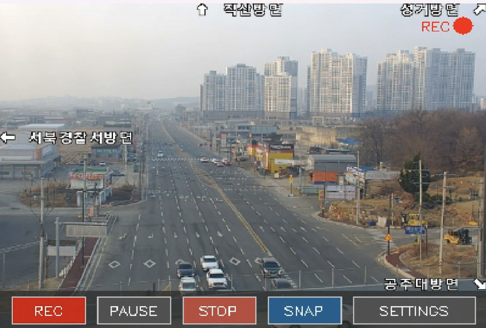
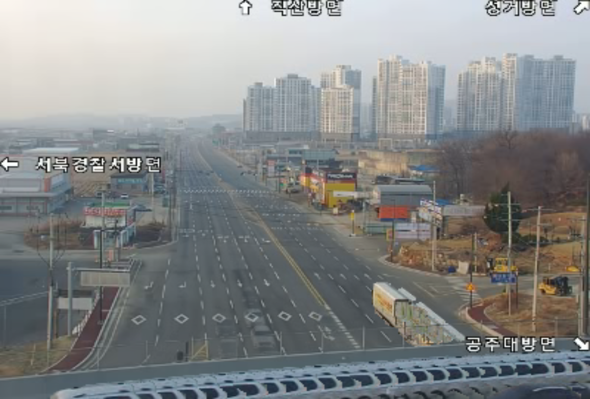

# RoadEye — 실시간 교통 CCTV 뷰어 & 레코더

나가기 전에 도로 상황부터 확인하세요. RoadEye는 RTSP를 통해 실시간 CCTV 스트림에 연결하여 교통 상황을 모니터링할 수 있는 경량 뷰어입니다. 재생 제어, 녹화, 스크린샷 기능을 간단한 GUI로 제공합니다.

## 기능

### 재생 제어
- **재생 / 일시정지** — `PAUSE` 버튼 또는 `P` 키로 토글
- **재생 속도 조절** — 0.25x ~ 4x (슬로우 모션 ~ 빨리감기), 설정 패널 또는 `+`/`-` 키
- **해상도 변경** — 320×240, 400×300, 640×480, 800×600 중 실시간 전환

### 녹화
- **영상 녹화** — `REC` 버튼 또는 `Space`/`R` 키로 녹화 시작/중지 (MP4, mp4v 코덱)
- **스크린샷** — `SNAP` 버튼 또는 `S` 키로 현재 프레임을 PNG로 저장
- 파일명은 타임스탬프 기반 자동 생성 (예: `rec_20260315_143022.mp4`, `snap_20260315_143025.png`)

### Vehicle Trail (차량 궤적 합성)
- **TRAIL 버튼** — 설정 패널에서 클릭하면 최근 녹화 영상을 분석
- 영상 전체에서 `BackgroundSubtractorMOG2`로 배경을 학습하고, 매 프레임의 차량(전경)을 추출
- 전체 영상의 차량 움직임을 **10초짜리 압축 영상**으로 합성 (`trail_*.mp4`)
- 모든 차량이 하나의 배경 위에 나타나는 **스냅샷 이미지**도 생성 (`trail_*.png`)

### GUI
- **컨트롤바** — 하단 반투명 바에 REC, PAUSE, STOP, SNAP, SETTINGS 버튼 배치
- **설정 패널** — 속도·해상도 `+`/`-` 버튼 + TRAIL 버튼
- **상태 표시** — 녹화 중 빨간 REC 점, 일시정지 오버레이, 현재 속도 표시

### 단축키

| 키 | 동작 |
|-----|------|
| `Space` | 녹화(Record) 토글 |
| `R` | 녹화(Record) 토글 |
| `P` | 일시정지 토글 |
| `S` | 스크린샷 |
| `+` / `=` | 속도 증가 |
| `-` | 속도 감소 |
| `ESC` | 종료 |

## 작동 방식

### 전체 흐름

```
RTSP 스트림 → VideoCapture → 프레임 읽기 루프 → 리사이즈 → [녹화] → UI 그리기 → 화면 출력
                                   ↑                           ↓
                             마우스/키 입력 ←── 컨트롤바 / 설정 패널
```

1. `cv.VideoCapture`로 RTSP 스트림에 연결
2. 메인 루프에서 프레임을 읽고, 현재 설정에 맞게 리사이즈
3. 녹화 중이면 UI를 그리기 **전에** 원본 프레임을 `VideoWriter`에 저장
4. 컨트롤바·설정 패널·상태 표시를 오버레이로 그린 뒤 화면에 출력
5. 속도에 따라 `waitKey` 대기 시간을 조절하고, 빠른 재생 시 프레임을 스킵

### 함수 설명

| 함수 | 설명 |
|------|------|
| `get_output_path()` | 현재 타임스탬프 기반으로 녹화 파일 경로 생성 (`rec_YYYYMMDD_HHMMSS.mp4`) |
| `point_in_rect(x, y, rect)` | 마우스 좌표 `(x, y)`가 버튼 영역 `rect` 안에 있는지 판정 |
| `on_mouse(event, x, y, flags, param)` | 마우스 콜백 — 클릭된 버튼에 따라 `state` 값을 토글/변경 |
| `draw_button(img, rect, text, bg_color, text_color)` | 지정된 위치에 배경색·텍스트가 있는 사각형 버튼을 그림 |
| `draw_control_bar(img)` | 하단 반투명 컨트롤바 렌더링 (REC, PAUSE, STOP, SNAP, SETTINGS) |
| `draw_settings_panel(img)` | 설정 패널 렌더링 — 속도·해상도 조절 `+`/`-` 버튼 포함 |
| `draw_status_bar(img)` | 상단 상태 표시 — REC 인디케이터, PAUSED 오버레이, 현재 속도 |

#### `editor.py` — 차량 궤적 합성
| 함수/클래스 | 설명 |
|-------------|------|
| `get_latest_video()` | `records/` 폴더에서 가장 최근 녹화 파일 경로 반환 |
| `generate_trail(video_path, out_duration)` | 영상 전체의 차량을 추출하여 `out_duration`초 압축 영상 + 스냅샷 생성 |
| `show_trail(video_path, out_duration)` | Trail 영상을 생성한 뒤 루프 재생으로 미리보기 |

### 상태 관리

모든 상태는 `state` 딕셔너리로 중앙 관리됩니다:

```python
state = {
    "recording": False,     # 녹화 중 여부
    "paused": False,        # 일시정지 여부
    "speed": 1.0,           # 재생 속도 (0.25x ~ 4x)
    "resolution_idx": 1,    # 해상도 인덱스 (RESOLUTIONS 리스트)
    "show_settings": False, # 설정 패널 표시 여부
    "screenshot": False,    # 스크린샷 요청 플래그
    "trail": False,         # Trail 합성 요청 플래그
}
```

마우스 클릭과 키보드 입력이 이 딕셔너리 값을 변경하고, 메인 루프가 매 프레임마다 값을 읽어 동작을 결정합니다.

## 스크린샷

- 녹화
> 


- Trail 
> 


## 실행 방법

```bash
pip install opencv-python
python main.py
```

## 요구 사항

- Python 3.10 이상
- OpenCV (`opencv-python`)
